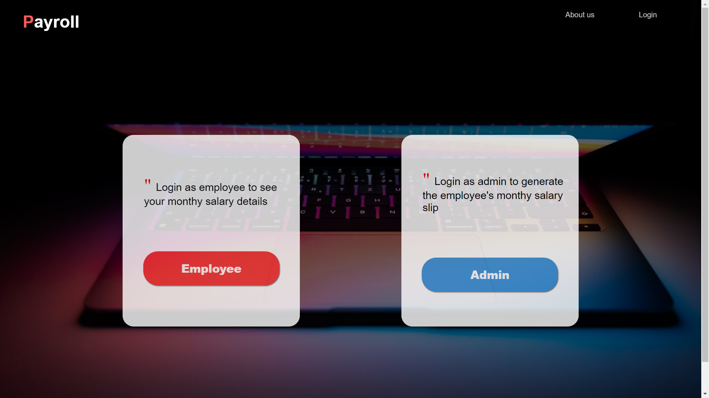
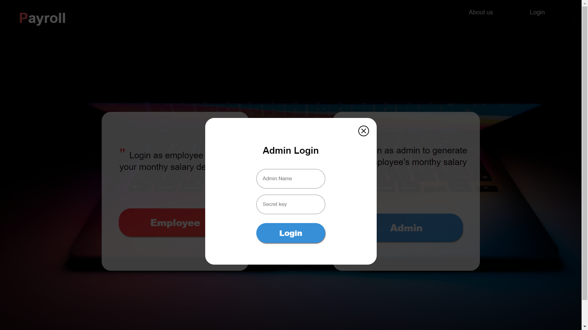
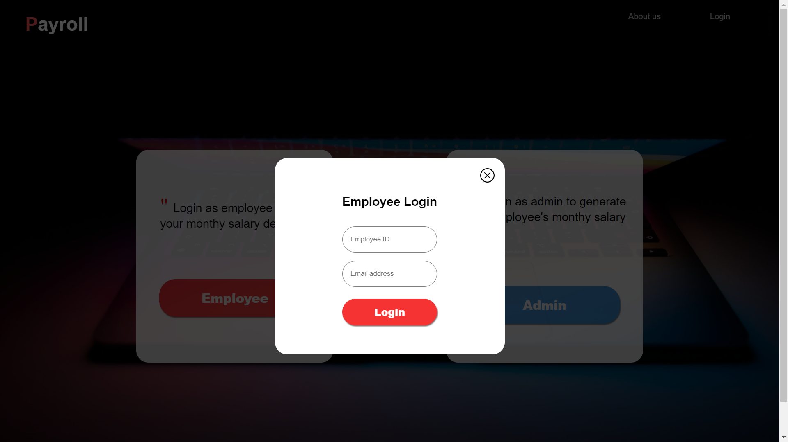
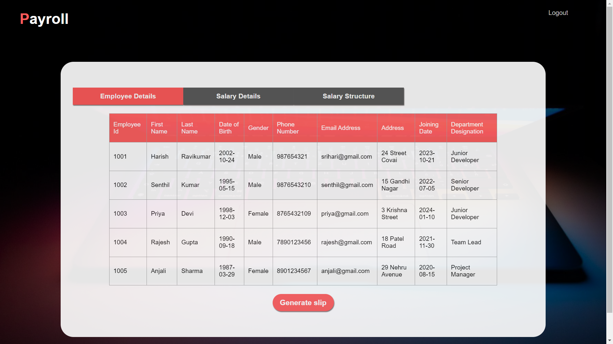
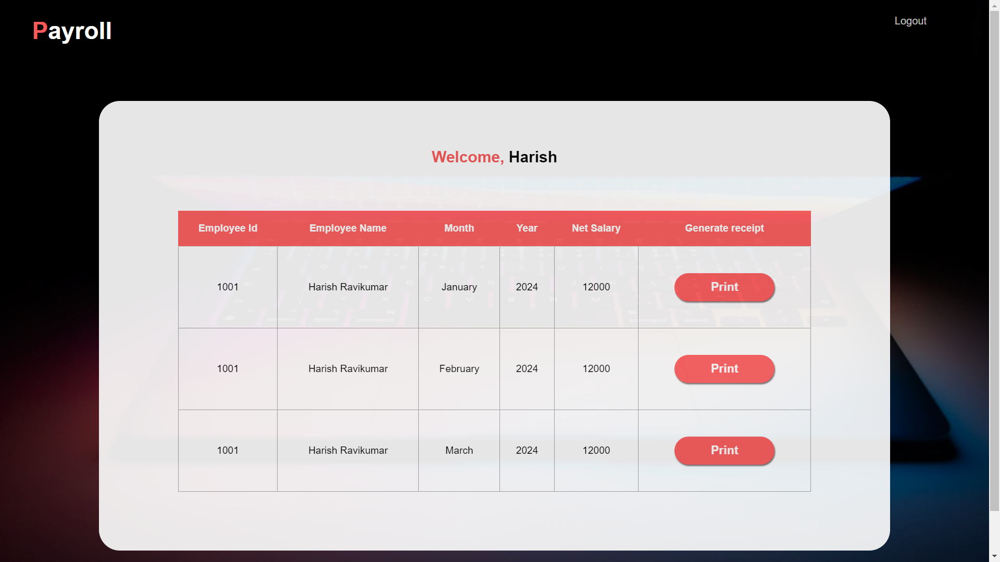

# Payroll System - Frontend Documentation

## Introduction

Welcome to the frontend documentation for the Payroll System. This document provides an overview of the user interface components, layouts, functionalities, and interactions of the frontend part of the system.

## Technology Stack

The frontend of the Payroll System is built using modern web technologies, including:

- HTML5
- CSS3
- JavaScript

## Folder Structure

The frontend project follows a structured organization, with the following directories:

- `assets/`: Contains the images required for styling.

## User Interface Components

The Payroll System frontend includes various UI components such as forms, tables, buttons, and navigation bars. These components are designed to provide a user-friendly experience and efficient navigation through the system.

## Download

Payroll FrontEnd: [Download here](https://github.com/harish96880/Payroll_FrontEnd)

## Pages and Layouts

The frontend consists of multiple pages and layouts, including:

- Home Page

- Admin Login Page

- Employee Login Page

- Admin Page

- Employee Details Page

Each page has a distinct layout structure and content placement, optimized for usability and readability.

## Styling and Theming

The frontend is styled using CSS3, with a focus on clean and modern design principles. A consistent color scheme, typography, and visual elements create a cohesive and visually appealing UI.

## Responsive Design

The UI is designed to be responsive and adaptive, ensuring optimal display across different devices and screen sizes. Media queries and responsive design techniques are employed to provide a seamless experience on desktops, tablets, and smartphones.

## Deployment and Hosting

The frontend of the Payroll System has been successfully deployed on GitHub Pages. You can access the deployed project using the following link:

[Payroll System - Frontend](https://harish96880.github.io/Payroll_FrontEnd/)

## Conclusion

This frontend documentation provides a comprehensive overview of the user interface components, layouts, functionalities, and interactions of the Payroll System frontend. It serves as a guide for developers, designers, and stakeholders involved in the frontend development process.
